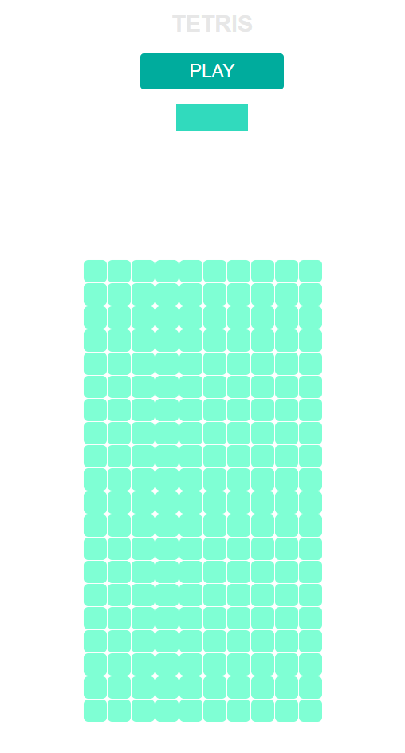
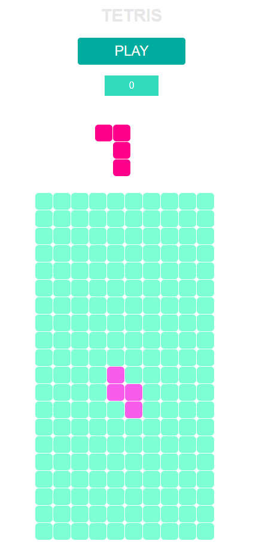

# Tetris

Game implemented from scratch in plain JavaScript following OOP patterns, CSS, HTML.

## Description

Using arrows you can move the blocks around, either left to right and you can rotate them.

## Features

- rotating pieces

- counting points

## Presentation

### Start

### Play mode

