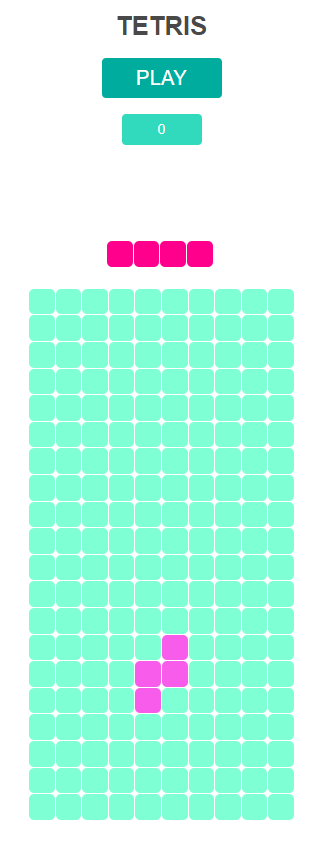
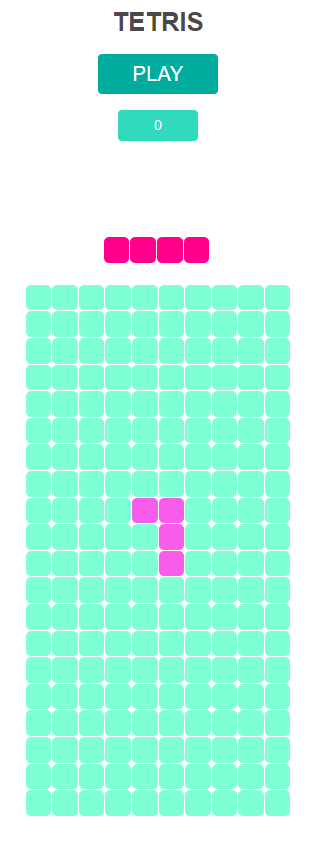
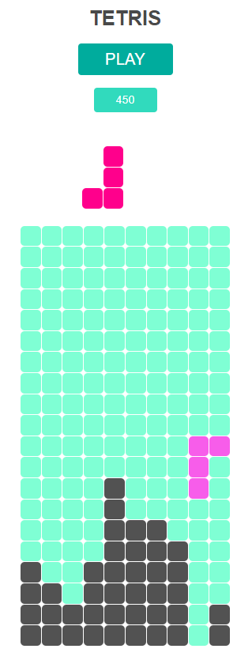

# Tetris Game

This Tetris game is implemented from scratch using plain JavaScript following object-oriented programming (OOP) patterns.

## About Tetris

Tetris is a highly addictive and popular puzzle game that challenges your strategic thinking and reflexes. The goal is to clear lines by arranging falling blocks, known as tetrominoes, in a way that creates a solid row of blocks without any gaps. Once a row is complete, it disappears, and you earn points.

## Description

The game provides a classic Tetris experience with intuitive controls and a scoring system.

Using arrows you can move the blocks around, either left to right and you can rotate them.

## Features

- Classic Tetris gameplay experience
- Controls to move, rotate, and drop the falling blocks
- Scoring system to track and display your score
- Preview of the next falling block
- Input field to enter your name and save your score

## How to Play

1. Game Initialization

- Open the game by launching the `index.html` file in your web browser

2. Starting the Game

- Click the "PLAY" button to start the game

3. Game Controls
   
- Use the arrow keys (up, down, left, right) to control the falling blocks:
     - Press the up arrow to rotate the blocks.
     - Press the left and right arrows to move the blocks horizontally.
     - Press the down arrow to move the blocks down faster.
     - Press the space bar to instantly move the block to the bottom.

4. Scoring

- Earn points by clearing lines.
- Each line cleared will contribute to your score.
- The more lines you clear simultaneously, the higher your score will be.

5. Game Over

- The game ends when the blocks stack up to the top of the game area.
- Once the game ends, you will be prompted to enter your name to record your score.
  
## Technologies Used

- JavaScript
- HTML5
- CSS3

## Presentation

### Start

### Play mode

Enjoy the challenge of aligning blocks and strive for the highest score! Have fun playing Tetris!
